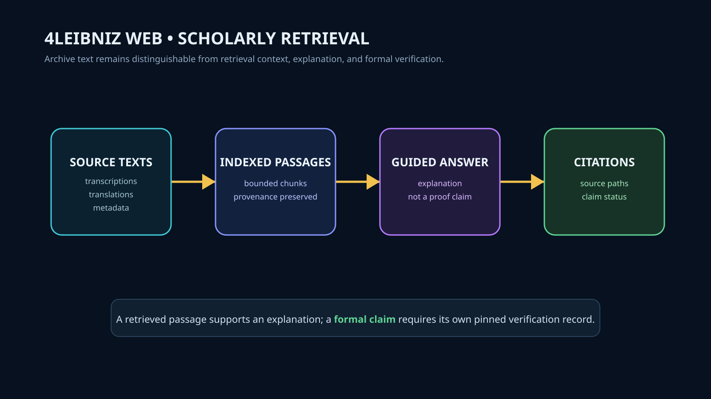

# 4leibniz-web

A living scholarly archive of Gottfried Wilhelm Leibniz — transcribed, translated, searchable, and guided. Next.js scholarly edition with grounded AI guidance.



## System Role & Consumer Boundary

`4leibniz-web` is the primary scholarly and reading interface for the 4Leibniz project. It provides paragraph-anchored transcriptions, Latin/French-to-English translations, and a citation-grounded retrieval interface.

### Strict Epistemic Invariant
- **Consumer Only**: This web application is a downstream consumer of theorem data from the canonical `4Leibniz` repository (`Mega-Therion/4Leibniz`).
- **No Independent Truth Claims**: The web interface does **not** evaluate proofs, compile Lean, or award `proved` badges on its own authority.
- **Verification vs. Explanation**: A retrieved passage or conversational response provides scholarly context and explanation; formal verification status is shown only when accompanied by an immutable commit-pinned claim record emitted by `4Leibniz` (#11).

## Active Integration Workstream

- **Upstream Contract (4Leibniz Issue #11)**: Consuming `artifacts/v1/formal-claims.json` via typed read-only routes (`/api/formal-claims`) to display verified theorem statuses and proof source locators.

## Core Features

- **Discourse on Metaphysics**: Complete 37-section edition anchored to the Montgomery 1908 critical text.
- **Monadology**: Complete 90-paragraph edition anchored to Latta 1898 — with the French original aligned paragraph-by-paragraph for side-by-side bilingual reading.
- **Corpus (39 works)**: the Theodicy (552 anchored sections including both appendices), the Duncan corpus of 32 shorter works (1679–1715), the Arnauld correspondence (23 letters), the Five Letters to Clarke, and the New Essays on Human Understanding (Preface + all 68 chapters, 69 anchored sections), plus Dr. Clarke's five replies from the 1717 Collection of Papers. Scanned-source works carry their OCR provenance in per-work editorial notes; correction passes are scheduled.
- **Scholarly Guide**: Retrieval-augmented reader interface backed by vector search and source citations.
- **Biographical & Lexicon Explorer**: Interactive contextual glossary of Leibnizian terminology.

## Architecture

```
User Query ──► /api/search / /api/chat ──► pgvector Retrieval ──► Grounded Text + Citation Links
                     │
                     ▼
         Read-Only Formal Catalog
       (artifacts/v1/formal-claims.json) ──► Verified / Conditional Badge
```

## Local Development

```bash
# Install dependencies
npm ci

# Run development server
npm run dev

# Run typecheck and tests
npm run typecheck
npm test
```
